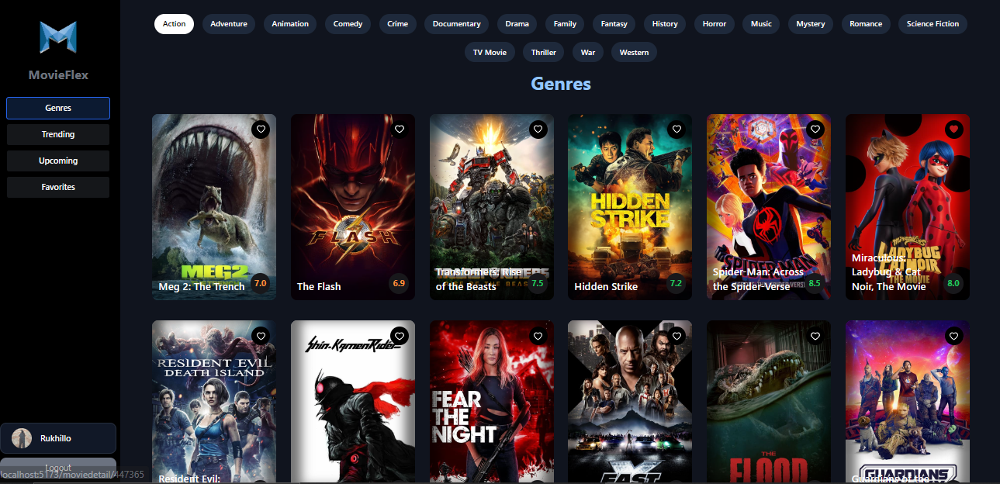
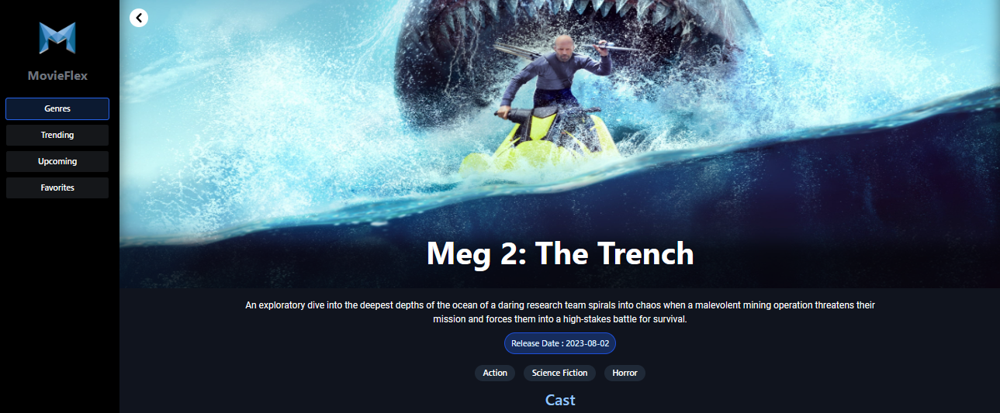
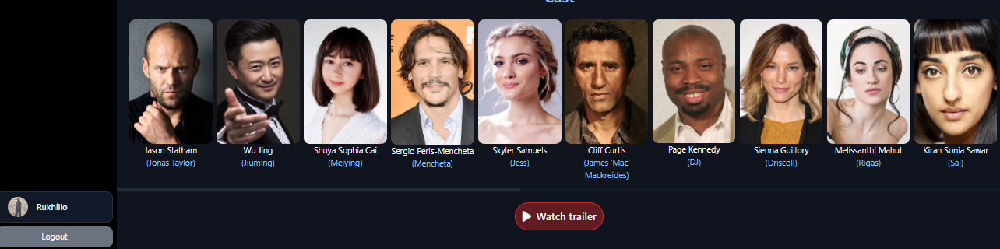

<h1 align="center">MovieFlex</h1>
MovieFlex is a React-based movie website that allows users to search for movies by title, sort them by genre, view trending and upcoming movies, and bookmark their favorite movies. The website is designed to be user-friendly and visually appealing.

# 🍿 Features 

- Search movies: users can search for movies by title
- Genre-wise display: movies can be sorted by genre
- Trending Movies: displays a section for trending movies
- Upcoming movies: displays a section for upcoming movies
- Movie Details: users can view detailed information about each movie
- Bookmark Movies: users can bookmark their favorite movies for later viewing
- Google Authentication: users can sign in using their Google account

# 🍿 Technology

BlueBird-Movies is built using the following technologies:

- ReactJS
- TMDB API
- Firebase Auth 
- Firebase FireStore
- Framer Motion

# 🍿 How to Run the Website on Your System

## Step 1: Clone the repository with the following command line

`git clone 'repo address.git'`
## Step 2: Install all dependencies
`npm install`
## Step 3: Obtain TMDB API key and Firebase configurations

Before starting the website, you will need to obtain the TMDB Movies API key and Firebase configuration. 

## Step 4: Run the App

Open your code editor (such as VS Code) and navigate to the project directory. Then, open a terminal and run the following command:

`npm run dev``

#  Demo 

- Check out our live demo at https://my-movieflex.netlify.app/ 
 

